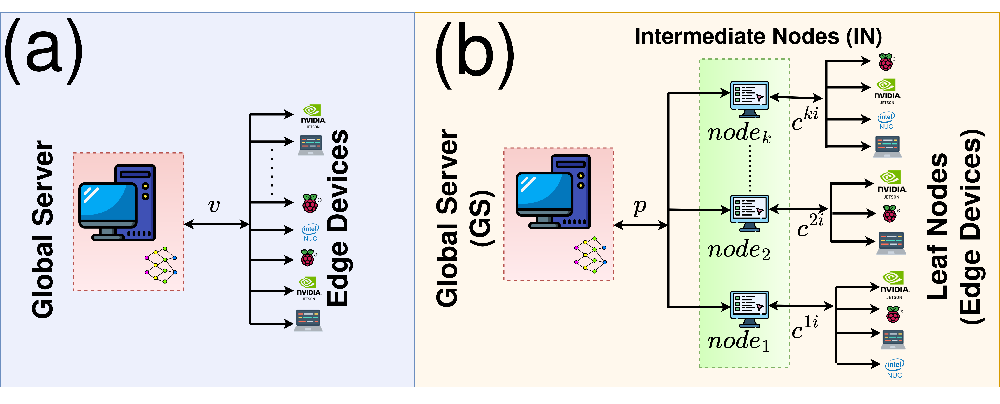
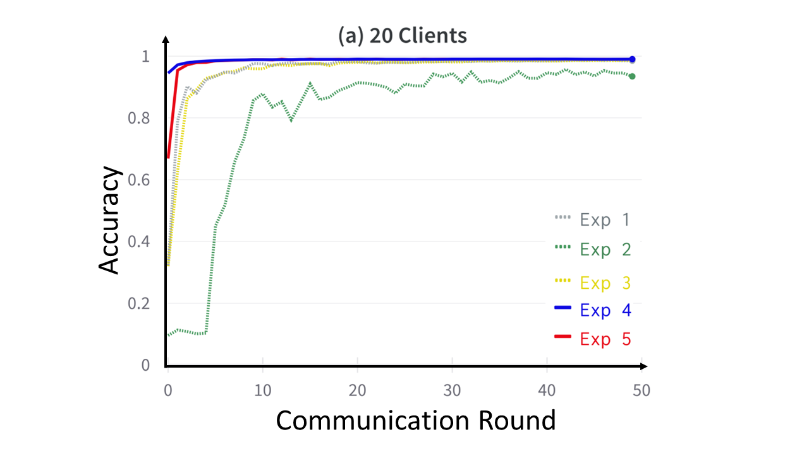
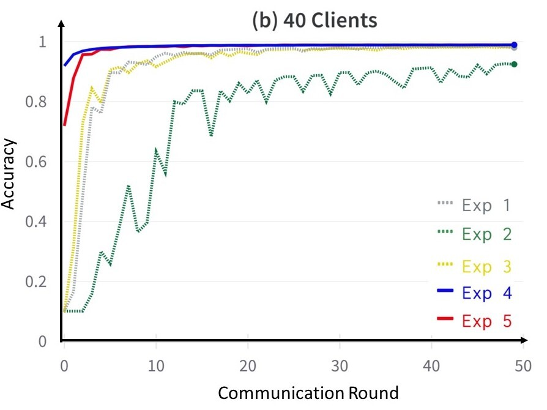
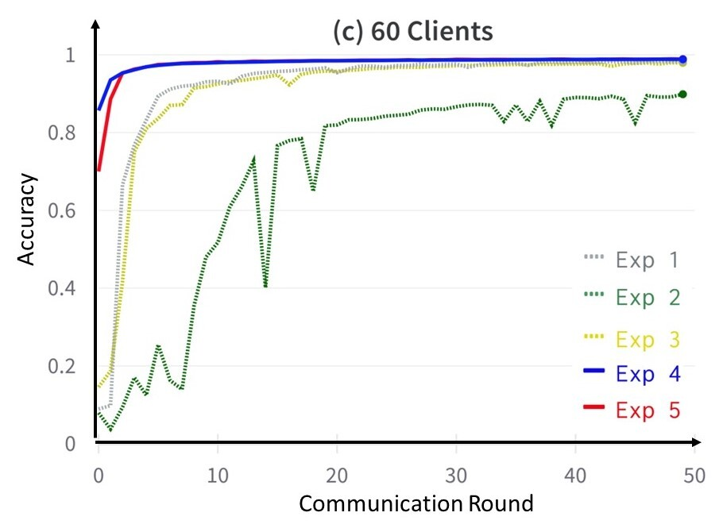
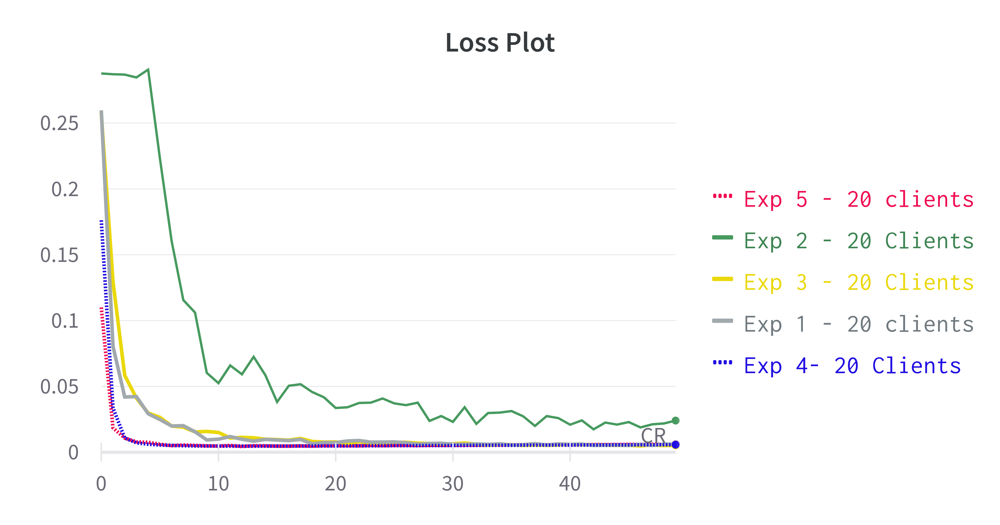
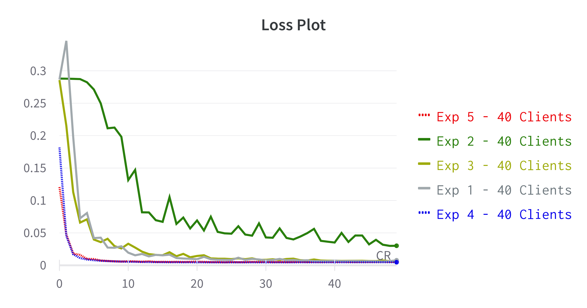
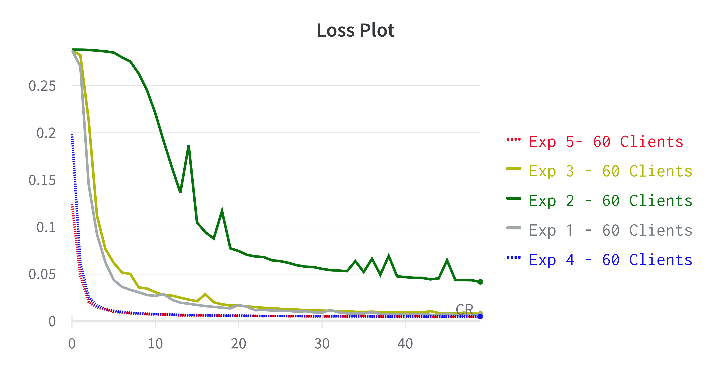

# Fed2Tier: A Two-Tier Federated Learning System Towards Green Computation
[](https://opensource.org/licenses/Apache-2.0)

`Fed2Tier` is a novel two-tier federated learning framework aimed at efficient and green computation. It represents an innovative approach to distributed machine learning that emphasizes privacy, scalability, and environmental sustainability. The Fed2Tier framework seeks to enhance model generalizability by involving a greater number of edge devices in the training process.

<div align="center">
  
  <br>
  <i>(a) Vanilla Federated Learning Architecture</i>
  <br>
  <i>(b) Fed2Tier Architecture</i>
</div>


## Supported devices
`Fed2Tier` has been extensively tested on and works with the following devices:

* Intel CPUs
* Nvidia GPUs
* Nvidia Jetson
* Raspberry Pi
* Intel NUC

## Installation

```
$ git clone https://github.com/apoorvakliv/fed2tier.git
$ cd `Fed2Tier`
$ pip install -r requirements.txt
```
## Starting server

```
python -m fed2tier.server.start_server \
 --algorithm fedavg \
 --nodes 1 \
 --n_rounds 10 \
 --s_rounds 10 \
 --batch_size 10 \
 --dataset MNIST \
```

## Starting Node

```
python -m fed2tier.node.start_node \
 --device cpu \
 --algorithm scaffold \
 --rounds 10 \
 --epochs 10 \
 --niid 4 \
 --clients 15 \
```

## Arguments to the clients and server

### Server

| Argument | Description | Default |
| --- | --- | --- |
| `--algorithm` | Algorithm to be used for aggregation by server | `fedavg` |
| `--nodes` | Number of nodes to be used | `1` |
| `--s_rounds` | Number of communication rounds to be executed by server | `10` |
| `--n_rounds` | Maximum number of communication rounds to be executed by nodes | `10` |
| `--batch_size` | Batch size to be used | `10` |
| `--dataset` | Dataset to be used | `MNIST` |
| `--net` | Network to be used | `LeNet` |
| `--accept_conn`| determines if connections accepted after FL begins          | `1`       |
| `--model_path` | specifies initial server model path                         | `initial_model.pt` |
| `--resize_size`| specifies dataset resize dimension                          | `32`      |
| `--threshold`  | specifies accuracy threshold for early stopping at each node| `0.8`     |

### Node

| Argument      | Description                                             | Default            |
|---------------|---------------------------------------------------------|--------------------|
| `--device`    | Device to run the client on                              | `cpu`              |
| `--wait_time` | Time to wait before sending the next request             | `5`                |
| `--clients`   | Number of clients to run                                 | `10`               |
| `--niid`      | niid or iid                                              | `1`                |
| `--algorithm` | Algorithm to run                                         | `fedavg`           |
| `--epochs`    | Number of epochs                                         | `5`                |
| `--mu`        | mu hyperparameter for fedprox                            | `0.1`              |
| `--rounds`    | Number of communication rounds                           | `20`               |
| `--carbon`    | If 1, track carbon emission of the node                   | `0`                |

## Architecture
Files architecture of `Fed2Tier`. These contents may be helpful for users to understand our repo.

```
fed2tier
├── fed2tier
│   ├── node
│   │   ├── src
│   │   |   ├── algorithms
│   │   |   ├── creae_datasets
│   |   |   ├── node_lib
│   |   |   ├── node
│   |   |   ├── ClientConnection_pb2_grpc
│   |   |   ├── ClientConnection_pb2
│   |   |   ├── data_utils
│   |   |   ├── distribution
│   |   |   ├── get_data
│   |   |   ├── net_lib
│   |   |   ├── net
│   │   └── start_node
│   └── server
│       ├── src
│       |   ├── algorithms
│       |   ├── server_evaluate
│       |   ├── client_connection_servicer
│       |   ├── client_manager
│       |   ├── client_wrapper
│       |   ├── ClientConnection_pb2_grpc
│       |   ├── ClientConnection_pb2
│       |   ├── server_lib
│       |   ├── server
│       |   ├── verification
│       └── start_server
│        
└── unittest
    ├── misc
    ├── test_server_algorithms
    ├── test_node_algorithms
    ├── test_datasets
    ├── test_models
    └── test_scalability
```

## Running tests

Various unittests are available in the `unittest` directory. To run any tests, run the following command from the root directory:

```
cd unittest
python test_server_algorithms.py
python test_node_algorithms.py
python test_models.py
python test_datasets.py
python test_scalability.py
```

## Federated Learning Algorithms

Following federated learning algorithms are implemented in this framework:

| Algorithm        | Paper                                                                                                                  | Server | Node  |
|:-------------:|:----------------------------------------------------------------------------------------------------------------------:|:------:|:-----:|
| FedAvg        | [Communication-Efficient Learning of Deep Networks from Decentralized Data](http://proceedings.mlr.press/v54/mcmahan17a/mcmahan17a.pdf)  | ✅     | ✅    |
| FedDyn        | [Federated Learning Based on Dynamic Regularization](https://openreview.net/forum?id=B7v4QMR6Z9w)                         |      | ✅    |
| Scaffold      | [SCAFFOLD: Stochastic Controlled Averaging for Federated Learning](PLACEHOLDER_LINK_FOR_SCAFFOLD)                        |      | ✅    |
| FedAdagrad    | [Adaptive Federated Optimization](https://arxiv.org/pdf/2003.00295.pdf)                                                | ✅     | ✅    |
| FedAdam       | [Adaptive Federated Optimization](https://arxiv.org/pdf/2003.00295.pdf)                                                | ✅     | ✅    |
| FedYogi       | [Adaptive Federated Optimization](https://arxiv.org/pdf/2003.00295.pdf)                                                | ✅     | ✅    |
| FedProx       | [FedProx: Federated Learning with Proximity](https://proceedings.mlsys.org/paper_files/paper/2020/file/1f5fe83998a09396ebe6477d9475ba0c-Paper.pdf)                                             |       | ✅    |


## Experiments Overview

In the experiments tagged as **Exp-1**, **Exp-2**, and **Exp-3** , we utilized the aggregation methods: **FedAvg**, **SCAFFOLD**, and **FedProx** . These were set within the standard FL framework. We incorporated client groups \( M \) consisting of 20, 40, and 60 members and designated \( v \) as 50. Throughout these experiments:

- 50% of our clients operated with a β value of 1 (i.i.d.)
- The remaining clients operated with β=4 (non-i.i.d)

To understand the performance of **Fed2Tier**, we initiated it with \( K=2 \). Within this configuration:

- One IN utilized a β=1 (i.i.d.) data pattern and adopted the **FedAvg** aggregation technique.
- A separate node, operating under β=4 (non-i.i.d.), chose either the **SCAFFOLD** (observed in Exp-4) or the **FedProx** (for Exp-5) aggregation methodology.

The GS applied **FedAvg** for merging models received from the IN. These trials were executed with client numbers \( N \) being 20, 40, and 60, evenly spread out across the IN.


### Benchmark of the proposed system with baselines

The following tables provide comparative analysis in terms of total time taken, carbon emitted, and accuracy between vanilla FL and *Fed2Tier*.

#### Time (Min)

| No. of client | Vanilla - Exp-1 | Vanilla - Exp-2 | Vanilla - Exp-3 | Proposed - Exp-4 | Proposed - Exp-5 |
|---------------|-----------------|-----------------|-----------------|------------------|------------------|
| 20            | 252.94          | 260.55          | 304.62          | 206.97           | 225.2            |
| 40            | 274.34          | 281.38          | 337.95          | 222.35           | 250.1            |
| 60            | 294.98          | 300.41          | 351.63          | 241.98           | 260.8            |

#### Carbon Emission (Kg)

| No. of client | Vanilla - Exp-1 | Vanilla - Exp-2 | Vanilla - Exp-3 | Proposed - Exp-4 | Proposed - Exp-5 |
|---------------|-----------------|-----------------|-----------------|------------------|------------------|
| 20            | 508             | 539.5           | 599             | 421.9            | 444.9            |
| 40            | 565.5           | 588.5           | 686             | 460.9            | 522.9            |
| 60            | 556.5           | 598.5           | 706.5           | 486.6            | 510.9            |

#### Accuracy (%)

| No. of client | Vanilla - Exp-1 | Vanilla - Exp-2 | Vanilla - Exp-3 | Proposed - Exp-4 | Proposed - Exp-5 |
|---------------|-----------------|-----------------|-----------------|------------------|------------------|
| 20            | 98.53           | 93.45           | 98.68           | 99.03            | 98.96            |
| 40            | 97.97           | 92.44           | 98.17           | 98.92            | 98.94            |
| 60            | 98.17           | 89.86           | 97.92           | 98.85            | 98.89            |


### Accuracy plots with (a) 20 clients, (b) 40 clients, and (c) 60 clients for Exp 1-5

<div align="center">
    
    
    
</div>

### Loss plots with (a) 20 clients, (b) 40 clients, and (c) 60 clients for Exp 1-5
<div align="center">
    
    
    
</div>

## Datasets & Data Partition

In real-world applications, Federated Learning (FL) must manage a multitude of data distribution situations, encompassing both iid and non-iid contexts. While there are established datasets and partition strategies for benchmark data, arranging datasets tailored to specific research challenges can be intricate. Furthermore, maintaining the results of these partitions during simulations can be challenging for researchers.

### Data Partition

We provide multiple Non-IID data partition schemes. 

### Datasets Supported

| Dataset                | Training samples         | Test samples       | Classes 
| ---------------------- | ------------------------ | ------------------ | ------------------ |
| MNIST                  | 60,000                   | 10,000             | 10                 |
| FashionMnist           | 60,000                   | 10,000             | 10                 |
| CIFAR-10               | 50,000                   | 10,000             | 10                 |
| CIFAR-100              | 50,000                   | 10,000             | 100                |

## Models Supported

`Fed2Tier` has support for the following Deep Learning models, which are loaded from `torchvision.models`:

* LeNet-5
* ResNet-18
* ResNet-50
* VGG-16
* AlexNet

## Carbon emission tracking

In `Fed2Tier` [CodeCarbon](https://github.com/mlco2/codecarbon) package is used to estimate the carbon emissions generated by clients during training. CodeCarbon is a Python package that provides an estimation of the carbon emissions associated with software code.

**Principal Investigator**


<a href="https://www.linkedin.com/in/debdoot/">Dr Debdoot Sheet</a> </br>
Department of Electrical Engineering,</br>
Indian Institute of Technology Kharagpur</br>
email: debdoot@ee.iitkgp.ac.in 


**Contributor**

<a href="https://in.linkedin.com/in/anupam-borthakur-b85000185/">Anupam Borthakur</a> </br>
Centre of Excellence in Artificial Intelligence, </br>
Indian Institute of Technology Kharagpur </br>
email: anupamborthakur@kgpian.iitkgp.ac.in </br>
Github username: anupam-kliv

<a href="https://www.linkedin.com/in/apoorva-srivastava-2a2ab9155/">Apoorva Srivastava</a> </br>
Centre of Excellence in Artificial Intelligence, </br>
Indian Institute of Technology Kharagpur </br>
email: apoorva.srivastava.23@iitkgp.ac.in </br> 
Github username: apoorvasrivastava23


<a href="https://www.linkedin.com/in/aditya-kasliwal-982525227">Aditya Kasliwal</a></br>
Manipal Institute of Technology</br>
email: kasliwaladitya17@gmail.com </br>
Github username: Kasliwal17


